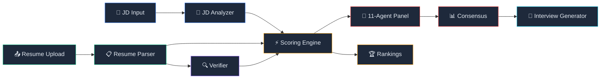

<div align="center">

# 🔍 TalentLens

### *See beyond the resume.*

**Multi-agent AI screening pipeline that evaluates candidates like a real hiring panel — 11 specialist agents, skills matching, background verification, and interview prep — all in one platform.**

[](https://python.org)
[](https://streamlit.io)
[](https://plotly.com)
[](LICENSE)

[**Getting Started**](#-getting-started) · [**Features**](#-features) · [**Architecture**](#-architecture) · [**Agent Panel**](#-the-11-agent-panel) · [**Dashboard**](#-dashboard) · [**CLI**](#-cli-usage)

</div>

---

## 🤔 The Problem

Screening resumes manually is slow, biased, and inconsistent. Even keyword-matching tools miss context — they can't tell if a "5-year AWS engineer" actually architected production systems or just followed tutorials.

## 💡 The Solution

**TalentLens** simulates a real hiring panel. Instead of one algorithm, **11 specialist AI agents** — from a Cloud Solutions Architect to a Security Architect to an HR Manager — independently evaluate every candidate, then debate and reach consensus. The result: a multi-dimensional score that captures what no single reviewer could.

---

## ✨ Features

<table>
<tr>
<td width="50%">

### 🤖 Multi-Agent Evaluation
11 specialist agents with distinct perspectives — architecture, security, QA, cloud, HR — each scores independently, then collaborates to reach consensus.

### 📊 Hybrid Scoring Engine
TF-IDF + Sentence-BERT + Jaccard similarity combined across 6 weighted dimensions. No single metric dominates.

### 🔍 Background Verification
Company verification via OpenCorporates, LinkedIn profile validation, email MX checks, employment timeline analysis, identity cross-referencing.

</td>
<td width="50%">

### 🎯 Zero-LLM Heuristic Mode
Full pipeline works without any API keys using regex-based parsing, rule-based scoring, and NLP heuristics. No cost, no rate limits.

### 📝 Interview Questionnaire Generator
Auto-generates targeted questions based on skill gaps and agent concerns. Export as DOCX for your interview panel.

### 📈 8-Page Dashboard
Glassmorphism UI with real-time pipeline tracking, interactive Plotly charts, candidate comparison radar charts, and full screening history.

</td>
</tr>
</table>

---

## 🏗 Architecture



### Module Map

```
├── main.py                  # CLI entry point (Typer)
├── dashboard_v3.py          # Streamlit 8-page dashboard
├── agents.py                # 11 specialist agent personas + consensus engine
├── scorer.py                # TF-IDF + SBERT + Jaccard scoring
├── jd_analyzer.py           # JD → structured criteria (LLM or heuristic)
├── resume_parser.py         # PDF/DOCX → candidate profile (LLM or heuristic)
├── heuristics.py            # Zero-LLM fallback: regex + NLP parsing
├── verifier.py              # Orchestrates all verification modules
│   ├── verifier_company.py  # OpenCorporates + LinkedIn company check
│   ├── verifier_certs.py    # Cert registry + Credly verification
│   ├── verifier_linkedin.py # Profile resolution + red flag detection
│   └── verifier_identity.py # Email, timeline, name cross-reference
├── interview_gen.py         # Questionnaire generator + DOCX export
├── history.py               # SQLite persistence (sessions, candidates, JDs)
├── models.py                # Pydantic/dataclass models
├── config.py                # .env loader + weight configuration
└── data/
    ├── cert_registry.json   # 30+ certifications with verification URLs
    └── known_companies.json # Company verification reference data
```

---

## 🤖 The 11-Agent Panel

Each agent brings a **unique evaluation lens**. They score independently, then engage in multi-round discussion to reach consensus.

| Agent | Focus | Weight |
|:------|:------|:------:|
| ☁️ **Cloud Solutions Architect** | AWS architecture, design patterns, Well-Architected | **14%** |
| 🔄 **AWS Migration Engineer** | Migration strategy, 6Rs, landing zones | **12%** |
| 🔒 **Security Architect** | Security posture, compliance, threat modeling | **10%** |
| 📡 **Cloud Operations Engineer** | Day-2 ops, observability, cost optimization | **10%** |
| 👥 **HR Manager** | Culture fit, career trajectory, soft skills | **10%** |
| 🏗️ **Application Architect** | System design, scalability, microservices | **8%** |
| ⚙️ **SRE Engineer** | Reliability, incident response, SLOs | **8%** |
| 🛠️ **AWS Platform Engineer** | IaC, Terraform, containers, CI/CD | **8%** |
| 🎯 **Recruiting Engineer** | Role alignment, market positioning | **8%** |
| 📦 **Product Owner** | Delivery track record, domain expertise | **6%** |
| 🧪 **QA Architect** | Testing strategy, automation, code quality | **6%** |

> Weights are tuned for cloud/platform engineering roles. Easily customizable in `agents.py`.

---

## 📊 Scoring Dimensions

The scoring engine combines **three similarity algorithms** across **six weighted dimensions**:

```
Score = TF-IDF (40%) + Sentence-BERT (40%) + Jaccard (20%)
```

| Dimension | Default Weight | What It Measures |
|:----------|:--------------:|:-----------------|
| Required Skills | **35** | Hard skill match against JD requirements |
| Experience | **25** | Years + relevance of work history |
| Preferred Skills | **15** | Nice-to-have skills and technologies |
| Education | **10** | Degree level + field relevance |
| Certifications | **10** | Verified professional certifications |
| Semantic Match | **5** | Deep contextual similarity (SBERT embeddings) |

> Weights are configurable via `.env` or the dashboard UI sliders. Must sum to 100.

---

## 🚀 Getting Started

### Prerequisites

- Python 3.11+
- (Optional) OpenAI or Anthropic API key — *heuristic mode works without any keys*

### Install

```bash
git clone https://github.com/rakshith-ponnappa/TalentLens.git
cd TalentLens

python -m venv .venv && source .venv/bin/activate  # Windows: .venv\Scripts\activate
pip install -r requirements.txt

cp .env.template .env   # edit with your API keys (optional)
```

### Launch Dashboard

```bash
streamlit run dashboard_v3.py
```

> Opens at `http://localhost:8501` — 8 pages: Welcome, JD Management, Screening, Results, Agent Panel, History, Analytics, Interview Prep.

---

## 💻 CLI Usage

```bash
# Load a job description
python main.py jd path/to/job_description.pdf

# Screen resumes
python main.py screen resume1.pdf resume2.pdf resume3.docx

# Full pipeline in one command
python main.py run --jd jd.pdf --resume r1.pdf --resume r2.pdf --detail

# Top 5 only, skip background checks
python main.py screen *.pdf --top 5 --no-verify
```

---

## 🖥 Dashboard

The Streamlit dashboard provides a complete screening workflow:

| Page | Purpose |
|:-----|:--------|
| 🏠 **Welcome** | Quick stats, agent overview, quick-start navigation |
| 📄 **JD Management** | Create, save, edit JDs + AI-assisted JD builder |
| 🔍 **Screening** | Step-by-step pipeline: JD → Resumes → Configure → Run |
| 📊 **Results** | Rankings table, stacked bar charts, candidate radar charts |
| 🤖 **Agent Panel** | Per-candidate consensus, individual agent evaluations, discussion log |
| 📅 **History** | Past sessions searchable by date/month/year |
| 📈 **Analytics** | Grade distribution, monthly trends, all-candidates view |
| ❓ **Interview Prep** | Auto-generated questionnaires, DOCX + JSON export |

---

## 🔍 Verification Pipeline

TalentLens cross-references candidate claims against real-world data:

- **🏢 Companies** — OpenCorporates API for registration status, jurisdiction, founding date
- **🔗 LinkedIn** — Profile URL resolution, name cross-check, completeness signals, red flag detection
- **📧 Email** — Format validation, MX record lookup, domain classification
- **📅 Timeline** — Employment gap analysis, experience calculation, date plausibility
- **🆔 Identity** — Cross-reference name, email, LinkedIn, and employment history

---

## ⚙️ Configuration

| Variable | Required | Description |
|:---------|:--------:|:------------|
| `OPENAI_API_KEY` | No | GPT-4o for LLM parsing (heuristic mode works without) |
| `ANTHROPIC_API_KEY` | No | Claude as alternative LLM provider |
| `LLM_PROVIDER` | No | `openai` (default) or `anthropic` |
| `OPENCORPORATES_API_KEY` | No | Higher rate limits for company verification |
| `WEIGHT_*` | No | Override scoring weights (e.g. `WEIGHT_REQUIRED_SKILLS=40`) |

---

## 🛠 Tech Stack

| Layer | Technology |
|:------|:-----------|
| **Language** | Python 3.11+ |
| **Dashboard** | Streamlit + Plotly |
| **NLP** | Sentence-Transformers (all-MiniLM-L6-v2), spaCy, scikit-learn |
| **LLM** | OpenAI GPT-4o / Anthropic Claude (optional) |
| **Storage** | SQLite (history, sessions, JDs) |
| **CLI** | Typer + Rich |
| **Verification** | OpenCorporates API, DNS MX lookups, HTTP resolution |
| **Export** | python-docx (DOCX), JSON |

---

## 📄 License

MIT — use it, fork it, build on it.

---

<div align="center">

**Built with curiosity and too much coffee.** ☕

*If TalentLens helped you, consider giving it a ⭐*

</div>
